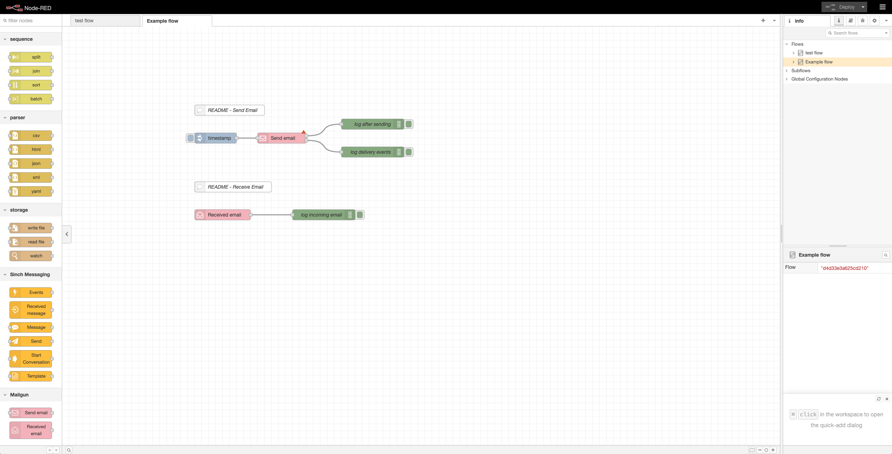

# @sinch/node-red-mailgun

A package of nodes for [Node-RED](https://nodered.org) which allows you to connect, send and receive emails through the Mailgun API. For more information about the Mailgun API and how to get started, see the [documentation](https://documentation.mailgun.com/en/latest/api_reference.html).



## Installation

The first step is to install [Node-RED](https://nodered.org/docs/getting-started/local).

```
$ sudo npm install -g node-red
```

> Compatible with Node-Red version 3.x.x and later

The second step is to install the package. You can either install it directly using the Palette Manager. Instructions can be found here: [Node-RED](https://nodered.org/docs/user-guide/runtime/adding-nodes).

Or install manually using npm:

Navigate to the Node-RED installation and install the package:

```
$ cd ~/.node-red
$ npm install @sinch/node-red-mailgun
```

Run Node-RED locally: 
```
$ node-red
```

This will start a server for Node-RED on [http://127.0.0.1:1880/](http://127.0.0.1:1880/).

If the installation of the node package was successful, the Mailgun nodes should be available in the node palette to the left, under the category "Mailgun". 

## Get started
After you've installed Node-RED and the @sinch/node-red-mailgun package you can start building your flow. To get you started we provide an example [flows.json](docs/examples/flow.json) containing the essentials for sending and receiving emails. To import the flows.json file, open Node-RED in the brower and select the hamburger menu in the top right corner. Choose "Import" and press "select a file to import". The flow file will then be imported on a tab called "Example flow". 

The flow.json contains two separate flow examples. For each of the flows there exists a comment node containing additional information about the configuration required to test it out.

### Testing
If you're running Node-RED locally on localhost and want to test receiving emails and events, we recommend using a tool like [Ngrok](https://ngrok.com/). This tool allow you to expose your localhost to the internet and makes it possible to route callback events to Node-RED. This is also a useful for testing the native Http-in node provided by Node-RED.

## More about the nodes
This package contains the following two nodes:

### Receive email node
Handles and routes incoming emails where the target email address field matches the configiured <strong>Match sender</strong> field.
Possible match creteria for the match sender field:
1. Exact match
2. Regular expression
3. Left empty (matches all)

In order to receive messages from Mailgun, you need to configure a route on the Mailgun [dashboard](https://app.mailgun.com/app/receiving/routes). The path should be: <i>&lt;node-red-path&gt;/mailgun/events-email</i>.


### Send email node
Sends emails through the Mailgun API. Can be configured to either send a plain text message or a template configured in the Mailgun [dashboard](https://app.mailgun.com/mg/dashboard). Sending -> Templates.

In order to receive events such as Delivered or Unsubscribed you need to configure a webhook for each event. This is also done in the Mailgun [dashboard](https://app.mailgun.com/mg/dashboard). Sending -> Webhooks. The path should be: <i>&lt;node-red-path&gt;/mailgun/events-email</i>.

## Contributing
See, [CONTRIBUTING.md](CONTRIBUTING.md).

## Copyright and license
Copyright Sinch AB, https://sinch.com under the [Apache 2.0 license](LICENSE).